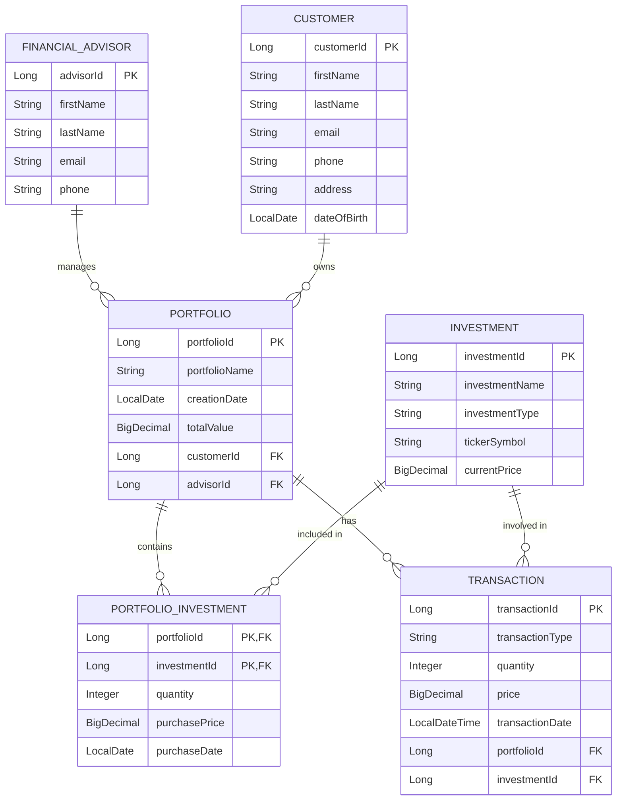

# Wells Fargo Forage - Portfolio Management System

## Project Overview
This project is a comprehensive **Portfolio Management System** developed as part of the Wells Fargo Software Engineering Virtual Experience Program (Forage). It is designed to help financial advisors manage their customers' investment portfolios efficiently.

The system demonstrates advanced back-end development principles using Java, Spring Boot, and Spring Data JPA. It strictly adheres to proper object-relational mapping (ORM) practices, handling complex entity relationships (One-to-Many, Many-to-One, and Many-to-Many with composite keys).

## Features
- **Advisor & Customer Management**: Financial advisors can manage multiple customers and their respective profiles.
- **Portfolio Tracking**: Customers can have multiple portfolios, managed by specific advisors, tracking total financial value.
- **Investment Management**: Supports a diverse catalog of investments that can be tracked across various portfolios.
- **Transaction History**: Logs detailed `BUY` and `SELL` transactions for robust auditing.
- **RESTful API Architecture**: Complete set of endpoints handling CRUD operations smoothly.
- **Data Transfer Objects (DTOs)**: Ensures database models are not directly exposed to the API layer, providing robust data validation.
- **Global Exception Handling**: Returns standardized JSON error responses across the entire application.

## Technologies Used
- **Language**: Java 17+
- **Framework**: Spring Boot 3.2
- **ORM & Database Interaction**: Spring Data JPA, Hibernate
- **Database**: MySQL 8+
- **Build Tool**: Maven
- **Boilerplate Reduction**: Lombok
- **Validation**: Jakarta Bean Validation

## Entity Relationship Diagram (ERD)
The underlying database schema relationships are modeled as follows:



## API Endpoints

### Advisors
- `POST /api/advisors`: Create a new financial advisor.
- `GET /api/advisors`: Retrieve all advisors.
- `GET /api/advisors/{id}`: Retrieve an advisor by ID.

### Customers
- `POST /api/customers`: Create a new customer profile.
- `GET /api/customers`: Retrieve all customers.
- `GET /api/customers/{id}`: Retrieve a customer by ID.

### Portfolios
- `POST /api/portfolios`: Create a new portfolio.
- `GET /api/portfolios`: Retrieve all portfolios.
- `GET /api/portfolios/{id}`: Retrieve a portfolio by ID.

*(See `postman_collection.json` in the repository for detailed request and response examples).*

## Installation Instructions

1. **Clone the Repository**
   ```bash
   git clone https://github.com/Kanishkushwah/wells-fargo-portfolio-management-.git
   cd wells-fargo-portfolio-management-
   ```

2. **Configure the Database**
   - Install MySQL Server and start the service.
   - Run the following SQL command to create the database:
     ```sql
     CREATE DATABASE portfolio_db;
     ```
   - Update `src/main/resources/application.properties` with your MySQL credentials:
     ```properties
     spring.datasource.username=root
     spring.datasource.password=your_password
     ```

3. **Build and Run**
   - Compile the project using Maven:
     ```bash
     mvn clean install
     ```
   - Run the application:
     ```bash
     mvn spring-boot:run
     ```
   - The application will start at `http://localhost:8080`.

## Screenshots
*(Add screenshots of your Postman requests, database schema generated in MySQL Workbench, or application logs here once deployed).*

## Author
**[Your Name / Username]**  
*Aspiring Software Engineer*  
Completed as part of the Wells Fargo Software Engineering Virtual Experience Program on Forage.
